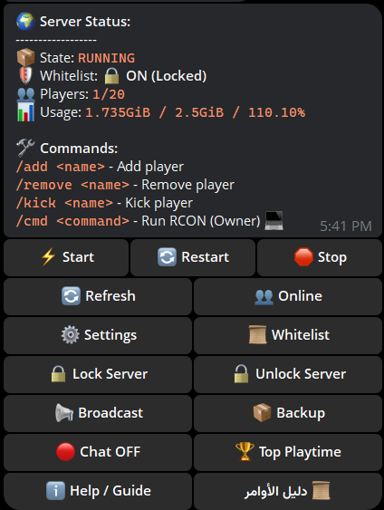
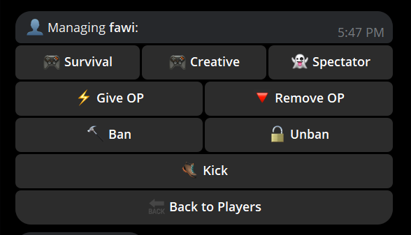
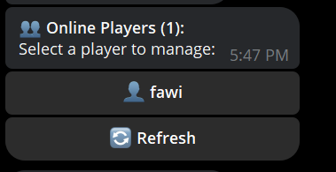

# 🤖 Pico Minecraft Bot


A powerful, standalone **Telegram Bot** to manage your Dockerized Minecraft Server directly from your chat app. Built for admins who want full control on the go.

## ✨ Features

### 🎮 Player Management
- **Live Status:** See who is online, current RAM/CPU usage, and server health.
- **Moderation:** Ban, Kick, and Whitelist management with one click.
- **Gamemode Control:** Switch players between Survival, Creative, and Spectator instantly.
- **Inventory:** Toggle `keepInventory` on/off without commands.

### ⚙️ Server Control
- **Power Actions:** Start, Stop, and Restart your server container remotely.
- **Properties Editor:** Modify `server.properties` (PvP, Flight, Difficulty, View Distance) via an interactive UI.
- **Backups:** Trigger instant backups and receive the zip file directly in Telegram.

### 🛡️ Security & Permissions
- **Owner-Only Access:** Critical commands (OP, DeOP, Console) are restricted to the bot owner.
- **Admin Whitelist:** Only authorized Telegram users can interact with the bot.
- **Console Mode:** Run raw RCON commands (`/cmd say Hello`) directly from chat.

### 💬 Chat Relay
- **Two-Way Communication:** Messages sent in Telegram appear in-game, and in-game chat appears in Telegram.
- **Join/Leave/Death Logs:** Get notified when players join or die (with funny death messages!).

---

## 🚀 Installation

### Prerequisites
- A server with **Docker** and **Docker Compose** installed.
- A running Minecraft container (e.g., [`itzg/minecraft-server`](https://github.com/itzg/docker-minecraft-server)).
- Python 3.8+ installed on the host (or run the bot in its own container).

### 1. Clone the Repository
```bash
git clone https://github.com/y1nn/pico-minecraft-bot.git
cd pico-minecraft-bot
```

### 2. Install Dependencies
```bash
pip install -r requirements.txt
```

### 3. Configure & Install 🪄
Run the interactive setup script:
```bash
python3 setup.py
```
This script will:
1.  Ask for your **Bot Token** and **ID**.
2.  Create the `.env` configuration file.
3.  **(Optional)** Install the bot as a **system service** effectively handling step 4 automatically!

---

## 🐳 Run with Docker (Advanced)

If you prefer keeping your host clean, you can run the bot in a container.

1.  **Configure**: Create `.env` using `setup.py` or manually.
2.  **Edit**: Open `docker-compose.yml` and **mount your Minecraft data**.
    *   *The bot needs access to `server.properties` to edit settings!*
3.  **Run**:
    ```bash
    docker-compose up -d
    ```

## 📸 Screenshots

| Server Status | Player Management | Command Shortcuts |
| :---: | :---: | :---: |
|  |  |  |

## 📚 Commands Reference

| Command | Description | Permission |
| :--- | :--- | :--- |
| `/add <name>` | Add a player to the whitelist | Admin |
| `/remove <name>` | Remove a player from the whitelist | Admin |
| `/kick <name>` | Kick a player from the server | Admin |
| `/cmd <command>` | Execute a raw RCON command (e.g. `/cmd say Hi`) | **Owner** |

> **Note:** Most management is done via the **Interactive Panel**. Just type `/start` or click buttons!

## ❓ Troubleshooting

### ❌ Bot not responding?
- Check if the Minecraft container is running: `docker ps`
- Ensure RCON is enabled in `server.properties`:
  ```ini
  enable-rcon=true
  rcon.password=yourpassword
  rcon.port=25575
  ```
- Check bot logs: `journalctl -u minecraft-bot -f` (if using Systemd)

### ⚠️ "RCON Connection Failed"
- Make sure the `CONTAINER_NAME` in `.env` matches your actual Docker container name.
- Verify the bot is running on the *same machine* as the Docker container.

## 🤝 Contributing
Pull requests are welcome! For major changes, please open an issue first to discuss what you would like to change.

## 📄 License
[MIT](LICENSE)
